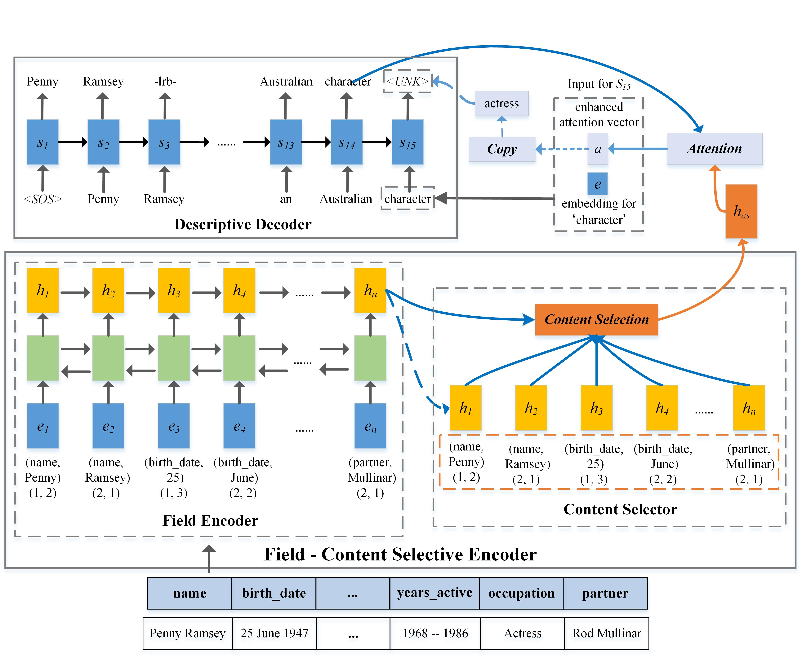

# WikiBio

*Generate text from Structured-data (Wikipedia Table)*.

## Model Overview

 

## Dependencies

* [PyTorch](https://pytorch.org) - Models, computational graphs are built with PyTorch.
* [Numpy](https://numpy.org) - Numpy provides the most-frequently-used operations for tensors.
* [Matplotlib](https://matplotlib.org/) - Matplotlib provides toolkits for visualizations in Python.
* [NLTK](https://www.nltk.org/) - Natural Language Toolkit, BLEU-Score calculator needed.
* [pyrouge](https://pypi.org/project/pyrouge/) - A Python wrapper for the ROUGE evaluation package.
* [tqdm](https://github.com/tqdm/tqdm) - Make epoch loops show a progress meter.

## Instructions

### Prepare Data

Download dataset: [WikiBio](https://github.com/DavidGrangier/wikipedia-biography-dataset) (Wikipedia biography dataset) released by David Grangier. It consists of the first paragraph and the infobox.

Decompressing the zip files and copy into a folder named 'data/original/'.

The cleaned data we have preprocessed can be downloaded at [Google Drive](https://drive.google.com/drive/folders/1ifn_YYmSYTPMPsGeiH-ly0j_Rj5ySOap?usp=sharing) .

### Usage

Run `preprocess/preprocess.py` to process original files into json-format files into 'data/' folder.

Alter `parameters.py` to tune hyper-parameters and settings.

Set `train_mode` in `parameters.py` as `True`, then run `train.py` to continue training/save model, and evaluate the pre-trained models with metrics **BLEU** and **ROUGE**.

The pickled model files we have trained can be downloaded at [Google Drive](https://drive.google.com/drive/folders/1wSuHSe-iEjdbA24Es1V7fpz35H1O8JiO?usp=sharing) .

Set `train_mode` in `parameters.py` as `False`, then run `data2text.py` to generate utterances and attention maps.

## Reference
